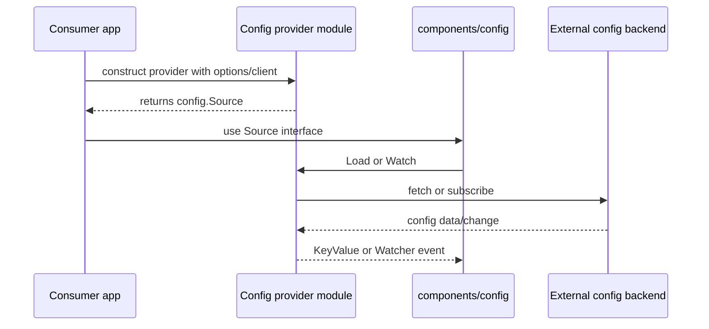
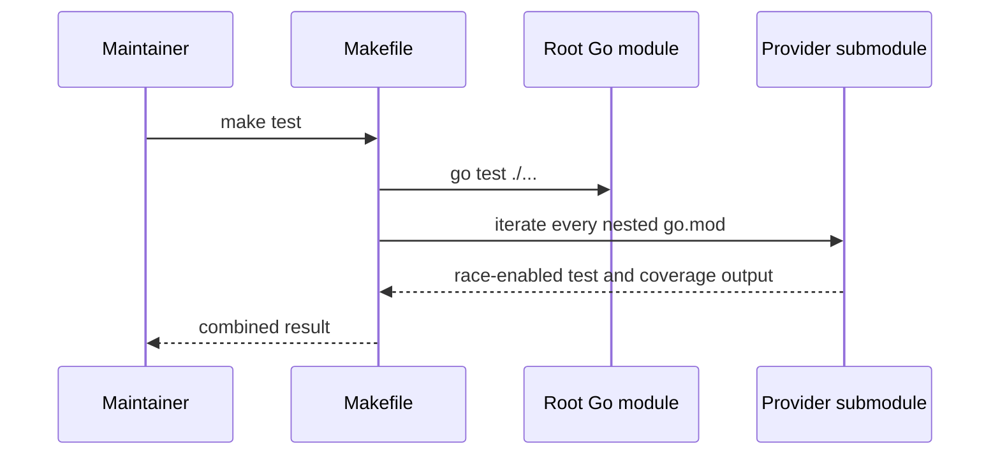
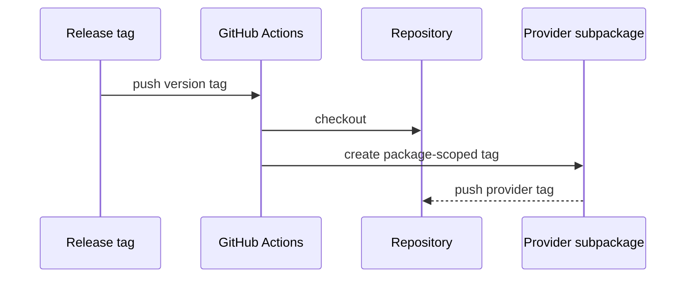

# Architecture

## Pattern Overview

This repository is a Go workspace of external implementations for interfaces from `github.com/go-jimu/components`. Each implementation is an independently versioned Go module under a capability/provider path, such as `config/etcd` or `logger/zap`, and adapts a third-party SDK to a stable component interface.

## System Context

- Consumers: Go services that depend on `go-jimu/components` interfaces and select a contrib provider module.
- Upstream contracts: `github.com/go-jimu/components` packages such as `config` and `logger`.
- External systems: Apollo, etcd, Kubernetes ConfigMaps, Nacos, and zap.
- Build and release environment: Go workspace, Makefile test runner, GitHub Actions.

## Layering

### Workspace Root

Defines the repository module and Go workspace membership. → `go.mod`, `go.work`

### Config Providers

Each config provider adapts one external configuration backend to `components/config.Source` and watcher contracts. → `config/apollo/`, `config/etcd/`, `config/kubernetes/`, `config/nacos/`

### Logger Providers

Logger providers adapt third-party logging libraries to `components/logger.Logger`. → `logger/zap/`

### Call-Direction Rules

Provider modules depend on `go-jimu/components` and their own backend SDK. The root workspace coordinates local development but does not own provider runtime behavior.

## Scenario Sequences

## Key Object FSMs

No aggregate or cross-bounded-context domain object state machines are present. Existing modules are infrastructure adapters for component interfaces, not domain aggregates.

## Key Design Decisions

- No ADRs recorded yet; current architecture is reflected by the workspace layout and provider modules.
